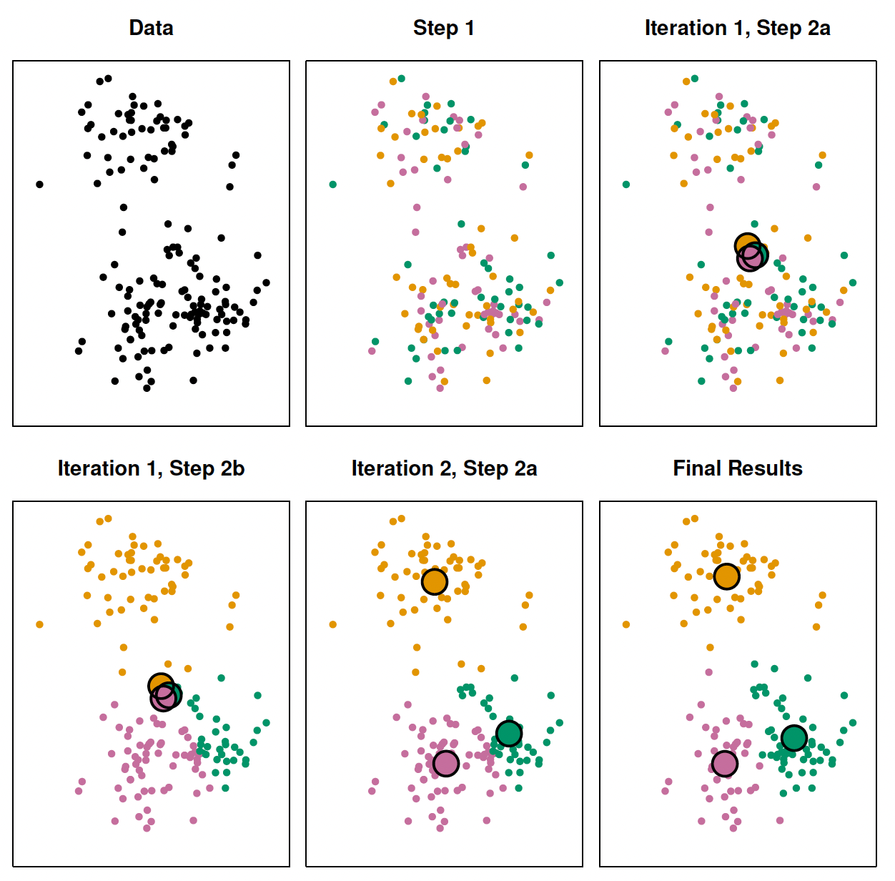
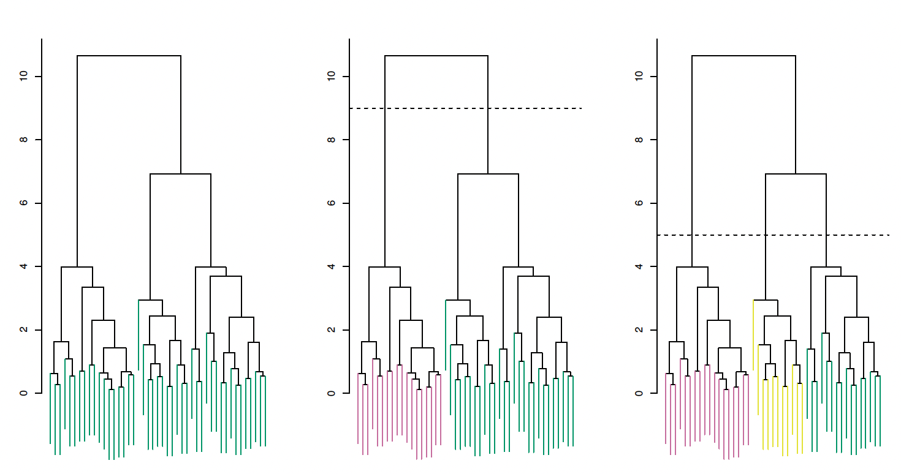
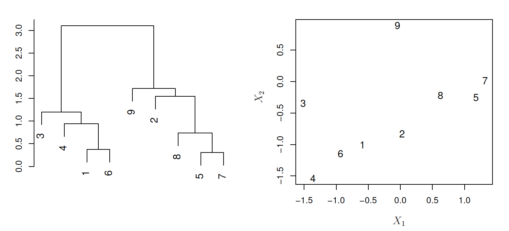
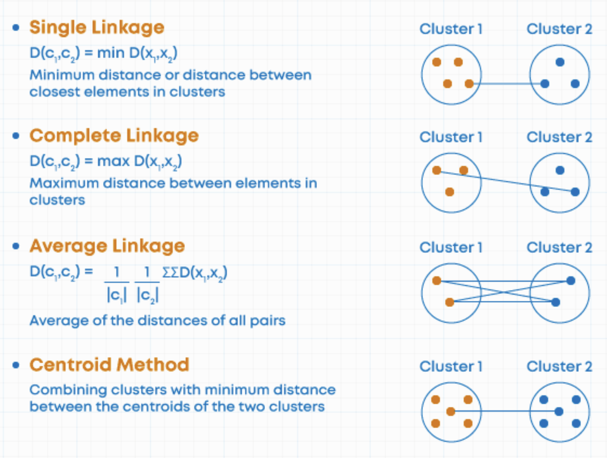
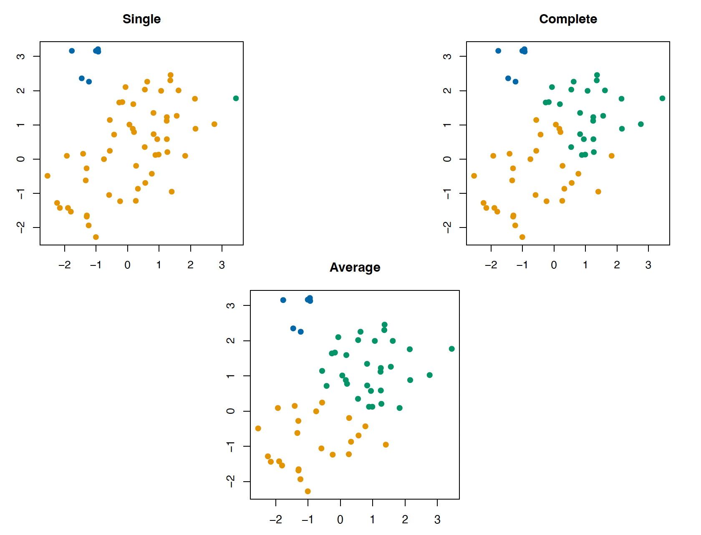
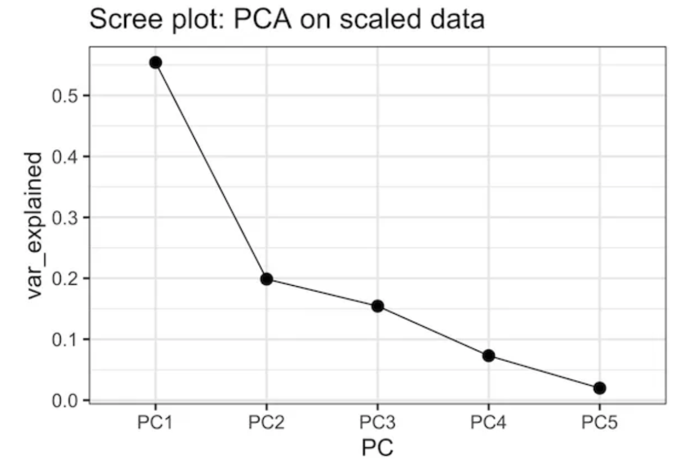
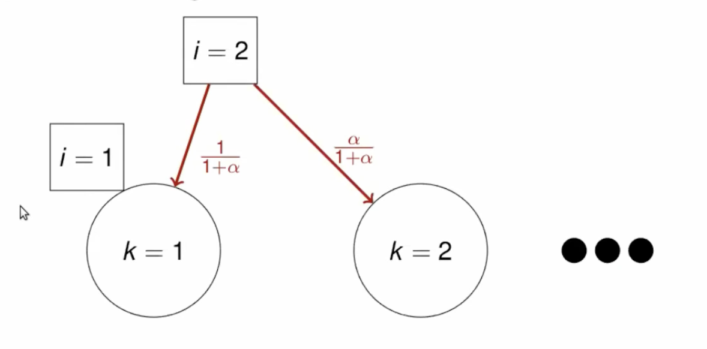

```{r setup, include=FALSE}
knitr::opts_chunk$set(echo = TRUE, 
                      warning = FALSE,
                      message = FALSE,
                      fig.pos = "center")

# Packages
library(tidyverse)
library(tidymodels)
library(tinytable)
library(kableExtra)
library(marginaleffects)

# ggplot global options
theme_set(theme_gray(base_size = 20))

# Colors
nu_purple =  "#4E2A84"
```


## Plan for today

**Discussion**

- Unsupervised learning
- Clustering
- Principal components
- Extension: Mixture models
- Semi-supervised learning (if we have time)
- Application readings

::: aside
Coding tutorials in the final slide
:::

# Unsupervised Learning

## Big picture

{fig-align="center"}

## Why is it called *unsupervised*?

## Types

1. Clustering

2. Dimension reduction

## Types

1. Clustering $\rightarrow$ Discrete groups

2. Dimension reduction

## Types

1. Clustering $\rightarrow$ Discrete groups

2. Dimension reduction $\rightarrow$ Probabilistic membership

## K-means clustering

**Algorithm**

. . .

1. Randomly assign a number (cluster), from $1$ to $K$, to each observation.

2. Iterate until cluster assignment stops changing:

    - For each cluster, compute centroid
    - Assign each observation to closest centroid
    
. . .

Stop when within-cluster variation is minimized

$$
\sum_{k=1}^K \text{WCV} (C_k)
$$
    
---

{fig-align="center"}


## Considerations

::: incremental
- Need to *know* how many clusters in advance

- Clusters are non-overlapping

- Every observation must belong to a cluster

- Categorical predictors need special handling (see k-medoids clustering)
:::

## Hierarchical clustering

**Algorithm**

. . .

1. Assign $n$ observations to $n$ unique clusters

2. Compute pairwise (Euclidean) distances

3. Fuse two clusters based on distance to compute $n-1$ clusters

4. Repeat until all observations belong to a cluster

## Which produces a dendrogram

{fig-align="center"}

---

{fig-align="center"}

## Problem

Combining two observations based on distance is easy

. . .

But how do we aggregate based on distances between clusters?

## Types of linkage

{fig-align="center"}


## Which linkage to use?

. . .

Single linkage suffers from **chaining** (clusters spread out and not compact enough)

. . .

Complete linkage suffers from **crowding** (clusters are compact but not far enough apart)

. . .

Average linkage uses more information, so it balances out

---

{fig-align="center"}


## Which linkage to use?

But average linkage suffers from what affects all averages

. . .

- Outliers

- Distance transformations (e.g. squared vs. absolute distance)

. . .

Centroids are less sensitive to these issues, but they are not meaningful in some applications


## Considerations

::: incremental

- No need to pre-specify number of clusters, but need to commit to a cutoff after fitting

- Choice of linkage and distance metric is consequential

- Every observation must belong to a cluster

:::

## Principal components analysis (PCA)

**Motivation**

::: incremental
- We want to visualize $n$ observations over $p$ features

- That means $\binom{p}{2}$ possible scatterplots

- We want to find a low dimensional representation of the data that captures as much information as possible

:::

## Fitting PCA

The first principal $z_{i1}$ component is a linear combination

$$
z_{i1} = \phi_{11}{x_{i1}} + \phi_{21}{x_{i2}} + \ldots + \phi_{p1} x_{ip} 
$$

. . .

The $\phi$ elements are a vector of *factor loadings*

. . .

Like a map to convert the values across $p$ predictors into one dimensional space

::: aside
This requires predictors to be scaled to mean zero
:::

## Fitting PCA

We find the values of $\phi$ by optimizing

$$
\underset{\phi_{11}, \ldots, \phi_{p1}}{\text{maximize}} \left \{ \frac{1}{n} \sum_{i=1}^n \left (\sum_{j=1}^p \phi_{j1} x_{ij} \right )\right\} \text{ subject to } \sum_{j=1}^p \phi_{j1}^2 = 1
$$

. . .

Meaning we are looking for factor loadings that maximize sample variance

. . .

The **second** principal component is is fitted in the same way, except that we constrain it to the set of linear combinations that are uncorrelated (orthogonal) to the first component

## Another way to think about it

. . .

The *first* principal component loading vector is the line in $p$-dimensional space that is closest to the $n$ observations

. . .

Adding the second, we make a *plane*

. . .

and the third to make a *hyperplane*

## Proportion of variance explained

The main idea is to reduce dimensions without dropping much information

. . .

We can determine the **proportion of variance** explained by a given number of principal components

$$
\text{PVE} = 1 - \frac{\text{RSS}}{\text{TSE}}
$$


Which also helps us to determine how many components are relevant to characterize the data

. . .

We can interpret the values of $z_{im}$ as measures of how much an observation *belongs* to that component

---

{fig-align="center"}

## Considerations

::: incremental
- PCs are more abstract than clusters

- Choice of relevant dimensions is arbitrary

- Restricted to linear combinations (but see ESL on principal curves and surfaces)

- Needs complete data set
:::

# Extension

## So far

We have unsupervised learning algorithms that either:

1. Make discrete clusters that drop information

2. Assign scores but are too restrictive and hard to interpret

. . .

Surprise! The solution is to take a Bayesian approach

## Mixture models

A family of Bayesian models that aims to identify subgroups within a population

. . .

The key is to assume that the data is generated by a **multimodal** distribution, then we can estimate posterior probabilities for each unit belonging to a group

::: aside
See [here](https://stephens999.github.io/fiveMinuteStats/intro_to_mixture_models.html) for a brief introduction
:::

## Example 1

**Latent Dirichlet Allocation (LDA)**

## LDA

**Motivation:** Latent topics in a document have a lot of *in-betweenness*

{fig-align="center"}

::: aside
See [Blei et al (2003)](https://www.jmlr.org/papers/volume3/blei03a/blei03a.pdf) for details
:::

---

{fig-align="center"}

## Considerations

::: incremental

- We get both topic proportions and assignments

- Need to choose and _**validate**_ the number of topics

- Does not read between the lines (but see STM)

:::

## Example 2

**Chinese Restaurant Proces (CRP)**

## CRP

**Motivation:** Seating customers in a restaurant with infinite tables of infinite capacity each

. . .

Start with a customer seating in one table

. . .


A new customer is assigned to a new table with probability $\frac{\alpha}{(i-1)+ \alpha}$

and to an existing table with probability $\frac{n_k}{(i-1)+ \alpha}$

where $n_k$ is the number of customers at a table and $\alpha$ is a *concentration* parameter

. . .

Larger $i$ $\rightarrow$ smaller probability of new cluster

## Whiteboard

{fig-align="center"}

::: aside
I am pretty sure this is not how Chinese restaurants work
:::

## Considerations

::: incremental
- LDA and topic models are *finite mixture models*

- CRP and alike are *nonparametric mixture models*

- CRP models a "rich get richer" process

- Creates fewer clusters

- Still need to choose a parameter

- Computationally intensive
:::

## Overall

Unsupervised learning is an impressionistic endeavor

. . .

No matter what you do, you need to defend your choice of hyperparameters


# Bonus-track

**Semi-supervised learning**

## Motivation

What do you do if you do not have labels for supervised learning?

. . .

1. Annotate a human-scale proportion of observations

2. Use them as a training set to then predict the rest of the data

. . .

If you do too little, you may overfit on the training data

. . .

Doing enough may take forever!

## Alternative: SSL

1. Label some data

2. Use an unsupervised learning algorithm to learn structure in both labeled and unlabeled data

3. Train supervised learning algorithm on the *extended* data

4. Evaluate test performance

. . .

We reduce overfitting but lose (potential) precision

## Approaches to SSL

- **Cluster-then-label:** Assume observations in the same cluster should have same label

- **Wrapper methods:** Create probabilistic *pseudo-labels*, retain high certainty observations and retrain (smoothness assumption)

- **Active learning:** Use unsupervised algorithm to determine which observations should be manually labeled next

::: aside
Learn more [here](https://www.ibm.com/think/topics/semi-supervised-learning)
:::

## Tutorials

- [Clustering and PCA in `{tidymodels}`](https://emilhvitfeldt.github.io/ISLR-tidymodels-labs/12-unsupervised-learning.html)

- [LDA in `{quanteda}`](https://tutorials.quanteda.io/machine-learning/topicmodel/)

- [Structural topic model with `{stm}`](https://juliasilge.com/blog/sherlock-holmes-stm/)

